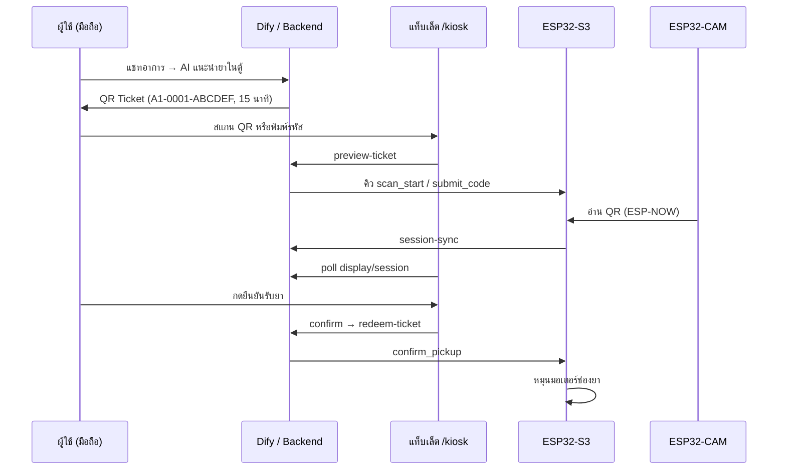
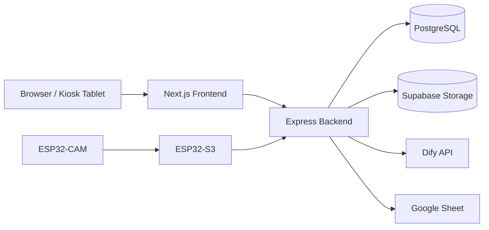

# LaneYa (เลนยา) — Monorepo

**LaneYa** คือระบบผู้ช่วยคัดกรองอาการและสนับสนุนการจ่ายยาอย่างปลอดภัย โดยเชื่อมต่อ AI (Dify), โปรไฟล์สุขภาพผู้ใช้, คลังความรู้, แดชบอร์ดผู้ดูแล และตู้จ่ายยาอัจฉริยะ (ESP32) ใน workflow เดียว

[English](#laneya-english) · [ภาษาไทย](#laneya-ภาษาไทย)

---

## สารบัญ (ภาษาไทย)

1. [วิสัยทัศน์และขอบเขต](#วิสัยทัศน์และขอบเขต)
2. [ฟีเจอร์หลัก](#ฟีเจอร์หลัก)
3. [เทคโนโลยี](#เทคโนโลยี)
4. [โครงสร้าง Monorepo](#โครงสร้าง-monorepo)
5. [สถาปัตยกรรมระบบ](#สถาปัตยกรรมระบบ)
6. [โมเดลข้อมูล (Prisma)](#โมเดลข้อมูล-prisma)
7. [Safety Check](#safety-check)
8. [แชท AI และ Pickup Ticket](#แชท-ai-และ-pickup-ticket)
9. [Kiosk (ตู้จ่ายยา)](#kiosk-ตู้จ่ายยา)
10. [คลังความรู้และ Google Sheet Sync](#คลังความรู้และ-google-sheet-sync)
11. [Internationalization (i18n)](#internationalization-i18n)
12. [API Reference](#api-reference)
13. [การติดตั้งและรัน Local](#การติดตั้งและรัน-local)
14. [ตัวแปรสภาพแวดล้อม](#ตัวแปรสภาพแวดล้อม)
15. [Deploy (Production)](#deploy-production)
16. [Hardware / Firmware](#hardware--firmware)
17. [สคริปต์และคำสั่งที่ใช้บ่อย](#สคริปต์และคำสั่งที่ใช้บ่อย)
18. [เอกสารเพิ่มเติม](#เอกสารเพิ่มเติม)
19. [Screenshot Placeholders](#screenshot-placeholders)
20. [Troubleshooting](#troubleshooting)

---

## LaneYa (ภาษาไทย)

### วิสัยทัศน์และขอบเขต

LaneYa ออกแบบมาเพื่อ:

- ให้ผู้ใช้ปรึกษาอาการเบื้องต้นกับ **AI เภสัชกร** พร้อมบริบทสุขภาพ (อายุ น้ำหนัก แพ้ยา โรคประจำตัว ยาที่ใช้อยู่)
- **ตรวจความปลอดภัย** ก่อนแนะนำยา — เทียบคำแพ้ยาของผู้ใช้กับส่วนประกอบยาในตู้
- ออก **QR Pickup Ticket** ให้ผู้ใช้ไปรับยาที่ตู้จ่ายยาภายใน **15 นาที**
- ให้ผู้ดูแลจัดการสต็อก ดูสถิติ ตรวจประวัติแชท และซิงค์คลังความรู้จาก Google Sheet
- รองรับ **Kiosk Display** บนแท็บเล็ต (สแกน QR / พิมพ์รหัส / ยืนยันรับยา) ผ่าน cloud relay หรือ LAN

> **Disclaimer:** ระบบ AI เป็นการประเมินเบื้องต้นเท่านั้น หากอาการรุนแรงให้พบแพทย์หรือโทรฉุกเฉิน 1669

---

### ฟีเจอร์หลัก

#### แอปผู้ใช้ (Web — `/th` หรือ `/en`)

| หน้า | Path | คำอธิบาย |
|------|------|----------|
| หน้าแรก | `/` | Hero ปรึกษา AI, สถานะ QR, ค้นหา, ทางลัดคลังความรู้, Health Tips |
| แชท AI | `/chat` | สนทนากับ LaneYa, streaming, ออก QR เมื่อ AI แนะนำยาในตู้ |
| คลังความรู้ | `/knowledge` | ค้นหา/เรียกดู โรค · อาการ · ยา |
| รายละเอียด | `/knowledge/disease/:slug`, `/symptom/:slug`, `/drug/:idOrSlug` | เนื้อหาสองภาษา |
| Health Tips | `/health-tips`, `/health-tips/:slug` | บทความสุขภาพ + อ้างอิง |
| ประวัติแชท | `/history`, `/history/:sessionId` | ย้อนดู session และข้อความ |
| ตั๋วรับยา | `/tickets` | สถานะ QR / ดาวน์โหลดตั๋ว |
| โปรไฟล์ | `/profile`, `/settings` | ข้อมูลสุขภาพ, รูปโปรไฟล์, เปลี่ยนรหัสผ่าน |
| ติดต่อ | `/contact` | แจ้งปัญหา + สถานะตู้ Kiosk |
| สมัคร / เข้าสู่ระบบ | `/register`, `/login` | บัญชี + Google Sign-In |
| นโยบาย | `/privacy`, `/cookies` | ข้อกำหนดและคุกกี้ |

#### แดชบอร์ดผู้ดูแล (`/admin`)

- **ภาพรวม** — สถิติเซสชัน, กราฟ 7 วัน, ยาใกล้หมด
- **สต็อก** — CRUD ยา, restock, รูปยา (Supabase Storage)
- **ประวัติ** — รายการแชท, feedback คุณภาพ AI
- **ผู้ใช้** — จัดการบัญชีผู้ใช้
- **Knowledge sync** — dry-run / sync จาก Google Sheet
- **Issue reports** — รายงานปัญหาจาก contact / kiosk
- **คีออส** — ทดสอบ servo, เปิด URL จอ kiosk, สถานะ heartbeat

#### Kiosk Display (`/kiosk`)

- หน้าจอแนวตั้งสำหรับแท็บเล็ตบนตู้ — **ไม่ลิงก์จากแอปผู้ป่วย**
- Screensaver + mascot (Capsi), swipe unlock
- สแกน QR ผ่าน ESP32-CAM หรือพิมพ์รหัส 12 ตัว
- Live camera preview (~2 fps) ผ่าน cloud relay หรือ LAN
- ยืนยันรับยา → redeem ticket → หมุนมอเตอร์ช่องยา

รายละเอียดเต็ม: [`frontend/KIOSK.md`](frontend/KIOSK.md)

---

### เทคโนโลยี

| ชั้น | เทคโนโลยี | หมายเหตุ |
|------|------------|----------|
| **Frontend** | Next.js 16 (App Router), React 19 | SSR + client components |
| **UI** | Tailwind CSS 4, Radix UI, shadcn/ui | `components/ui/*` |
| **i18n** | next-intl 4 | locale `th` (default), `en` |
| **Charts** | Recharts | แดชบอร์ด admin |
| **Backend** | Express 4 + TypeScript (ESM) | port 4000 (default) |
| **ORM** | Prisma 6 + PostgreSQL | Supabase Postgres |
| **Auth** | JWT (user) + Admin JWT / API key | bcrypt password |
| **Storage** | Supabase Storage | รูปโปรไฟล์ / รูปยา |
| **AI** | Dify API | chat + streaming, guardrails |
| **Rate limit** | express-rate-limit | auth, chat, kiosk display |
| **Security** | helmet, CORS whitelist | |
| **Hardware** | ESP32-S3, ESP32-CAM, PCA9685, MG90S | PlatformIO / Arduino IDE |

**Node.js:** backend ต้องการ `>=18` (Render ใช้ Node 22)

---

### โครงสร้าง Monorepo

```text
.
├── frontend/                    # Next.js — UI, i18n, API client
│   ├── app/
│   │   ├── [locale]/            # หน้าเว็บหลัก (th/en)
│   │   │   ├── page.tsx         # Home
│   │   │   ├── chat/
│   │   │   ├── admin/
│   │   │   ├── knowledge/
│   │   │   ├── health-tips/
│   │   │   ├── history/
│   │   │   ├── profile/
│   │   │   └── ...
│   │   └── kiosk/               # Kiosk display (ไม่มี locale prefix)
│   ├── components/
│   │   ├── kiosk/               # Kiosk UI, mascot, screensaver
│   │   ├── ui/                  # shadcn components
│   │   └── web/                 # Top nav, shell
│   ├── messages/                # catalog.ts — ข้อความ UI (TH/EN)
│   ├── lib/                     # API helpers, auth, kiosk constants
│   ├── hooks/
│   ├── public/kiosk/            # caps-i mascot SVG/PNG
│   ├── scripts/                 # export-capsi-png.mjs
│   ├── middleware.ts            # i18n + kiosk token gate
│   ├── KIOSK.md                 # เอกสาร kiosk แบบละเอียด
│   └── .env.local.example
│
├── backend/                     # Express API + Prisma
│   ├── src/
│   │   ├── index.ts             # Express app entry
│   │   ├── routes/index.ts      # ทุก route
│   │   ├── controllers/         # auth, chat, drugs, kiosk, admin, ...
│   │   ├── services/            # Dify, knowledge sync, kiosk display
│   │   ├── middleware/          # auth, adminAuth
│   │   └── lib/                 # safetyCheck, chatGuardrails, ...
│   ├── prisma/
│   │   ├── schema.prisma
│   │   ├── seed.ts              # ยา A1–B5 + admin seed
│   │   └── migrations/
│   ├── scripts/                 # backfill-usernames, sync-knowledge-sheet
│   └── .env.example
│
├── hardware/                    # Firmware ESP32
│   ├── esp32-s3-laneya-kiosk/   # บอร์ดหลักตู้จ่ายยา
│   ├── esp32-cam-laneya/        # กล้อง + QR reader (ESP-NOW)
│   ├── esp32-s3-connext/        # ทดสอบ WiFi + heartbeat
│   └── README.md
│
├── docs/
│   ├── ai/                      # system prompt, Dify setup, knowledge base
│   ├── google-sheet.md          # สเปกชีทซิงค์
│   ├── knowledge-sheet-data-validation.md
│   └── screenshots/
│
├── devrun.bat                   # Windows: เปิด backend + frontend พร้อมกัน
├── render.yaml                  # Render Blueprint (backend)
└── package.json                 # npm workspaces (root)
```

---

### สถาปัตยกรรมระบบ

#### ภาพรวม

```mermaid
flowchart TB
  subgraph Client
    U[ผู้ใช้ / แท็บเล็ต Kiosk]
    A[ผู้ดูแล Admin]
  end

  subgraph Frontend["Next.js (Vercel)"]
    FE[App Router + next-intl]
    K[/kiosk display]
  end

  subgraph Backend["Express API (Render)"]
    API[REST API]
    SC[Safety Check]
    CG[Chat Guardrails]
  end

  subgraph External
    DB[(PostgreSQL / Prisma)]
    SF[(Supabase Storage)]
    AI[Dify API]
    GS[Google Sheet]
  end

  subgraph Hardware
    S3[ESP32-S3 Kiosk]
    CAM[ESP32-CAM]
  end

  U --> FE
  A --> FE
  FE --> API
  K --> API
  API --> DB
  API --> SF
  API --> AI
  API --> GS
  S3 -->|heartbeat, camera-frame, session-sync| API
  CAM -->|ESP-NOW + JPEG :81| S3
  S3 -->|servo dispense| MOT[มอเตอร์ช่องยา]
```

#### Flow รับยาที่ตู้ (Pickup)



---

### โมเดลข้อมูล (Prisma)

ไฟล์: [`backend/prisma/schema.prisma`](backend/prisma/schema.prisma)

#### ผู้ใช้และสุขภาพ (`User`)

| ฟิลด์ | คำอธิบาย |
|-------|----------|
| `username`, `email`, `phone` | บัญชี |
| `avatarUrl` | รูปโปรไฟล์ (Supabase) |
| `age`, `weight`, `height`, `gender` | บริบทสุขภาพสำหรับ AI |
| `allergiesText` | ประวัติแพ้ยาแบบข้อความ |
| `allergyKeywords` | คำสำคัญ normalize สำหรับ Safety Check |
| `noAllergies`, `diseasesText`, `noDiseases` | โรคประจำตัว |
| `currentMedications` | ยาที่ใช้อยู่ (ป้องกัน drug-drug) |
| `isAdmin` | สิทธิ์ผู้ดูแล |

#### ยาในตู้ (`Drug`)

| ฟิลด์ | คำอธิบาย |
|-------|----------|
| `slotId` | ช่องในตู้ (unique) เช่น `A1` |
| `quantity` | จำนวนคงเหลือ |
| `ingredientsText` | ส่วนประกอบ comma-separated สำหรับ safety |
| `imageUrl` | รูปยา |
| `expiresAt`, `priceCents` | วันหมดอายุ / ราคา (optional) |

#### แชทและตั๋ว

| Model | คำอธิบาย |
|-------|----------|
| `ChatSession` | session แชท, severity, recommendedDrug |
| `ChatMessage` | ข้อความ user/assistant |
| `PickupTicket` | QR code, อายุ 15 นาที, signature, status |
| `AdminSessionReview` | feedback คุณภาพจาก admin |

#### คลังความรู้

| Model | คำอธิบาย |
|-------|----------|
| `KnowledgeDisease`, `KnowledgeSymptom` | โรค / อาการ (TH/EN) |
| `DiseaseSymptomMap`, `DiseaseDrugMap`, `SymptomDrugMap` | ความสัมพันธ์ |
| `KnowledgeHealthTip` + `Reference` | บทความ + อ้างอิง |
| `UiTranslation` | ข้อความ UI จาก Sheet |
| `SyncLog` | บันทึกการ sync |

#### อื่นๆ

| Model | คำอธิบาย |
|-------|----------|
| `IssueReport` | รายงานปัญหา (contact / kiosk) |
| `AdminAuditLog` | audit การกระทำของ admin |

---

### Safety Check

Utility: [`backend/src/lib/safetyCheck.ts`](backend/src/lib/safetyCheck.ts)

**Logic:**

1. อ่านคำแพ้ยาจาก `allergyKeywords` (strict) หรือ fallback จาก `allergiesText`
2. ถ้า `noAllergies = true` → ไม่มีคำแพ้ยา
3. เทียบกับ `Drug.ingredientsText` (case-insensitive, substring match)
4. คืนค่า `{ isSafe, matchedAllergies, checkedAllergies, checkedIngredients }`

**Endpoint:** `GET /api/drugs/:id/safety-check` (ต้อง login)

ใช้ร่วมกับ chat guardrails ก่อนออก QR — ถ้าไม่ปลอดภัยจะไม่ออกตั๋ว

---

### แชท AI และ Pickup Ticket

| หัวข้อ | รายละเอียด |
|--------|------------|
| Provider | Dify (API key เก็บใน backend เท่านั้น) |
| Endpoints | `POST /api/chat`, `POST /api/chat/stream` |
| Guardrails | jailbreak detection, sanitize output, risk rubric |
| Profile gate | ถาม missing fields สูงสุด 2 ฟิลด์ต่อเทิร์น |
| QR format | `A1-0001-ABCDEF` (slot + sequence + checksum) |
| อายุตั๋ว | **15 นาที** หลังออก |
| Ticket status | `GET /api/tickets/:code/status` |

**ตั้งค่า Dify:** [`docs/ai/DIFY_SETUP.md`](docs/ai/DIFY_SETUP.md)  
**System prompt:** [`docs/ai/laneya-system-prompt.md`](docs/ai/laneya-system-prompt.md)  
**Knowledge base สำหรับ AI:** [`docs/ai/laneya-knowledge-base.md`](docs/ai/laneya-knowledge-base.md)

---

### Kiosk (ตู้จ่ายยา)

#### URL

| สภาพแวดล้อม | URL |
|-------------|-----|
| Production (Vercel) | `https://<domain>/kiosk?token=<KIOSK_DISPLAY_TOKEN>` |
| Dev (PC ใน LAN) | `http://localhost:3000/kiosk?token=<KIOSK_DISPLAY_TOKEN>` |
| LAN fallback (firmware S3) | `http://<S3-IP>/kiosk` |

Token ตั้งใน `KIOSK_DISPLAY_TOKEN` — middleware ตรวจ query/cookie แล้ว redirect ลบ token จาก URL

#### Cloud relay architecture

```
Tablet (HTTPS/Vercel)
  ↔ GET/POST /api/kiosk/display/*  (Render)
  ↔ GET /api/kiosk/display/camera-frame  (poll ~450ms)
ESP32-S3
  ↔ POST heartbeat + session-sync
  ↔ GET http://CAM:81/jpg → POST /api/kiosk/camera-frame
  ↔ ESP-NOW ↔ ESP32-CAM (QR scan)
ESP32-CAM
  ↔ capture JPEG loop ~450ms
  ↔ QR reader (pause 80ms ระหว่าง capture)
```

#### Flow ย่อ

1. ผู้ใช้ได้ QR จากแชท
2. Kiosk สแกน / พิมพ์รหัส → `preview-ticket`
3. แสดงยา + countdown → ผู้ใช้กดยืนยัน
4. `redeem-ticket` → S3 หมุนมอเตอร์

พิมพ์รหัส: **12 ตัวติดกัน** ไม่ต้องใส่ `-` เช่น `A10001ABCDEF`

---

### คลังความรู้และ Google Sheet Sync

ซิงค์จาก Google Sheet → PostgreSQL ผ่าน Admin หรือ CLI:

```bash
cd backend && npm run knowledge:sync
```

**แท็บที่ต้องมี:** Disease, Symptom, Drug, Map_Disease_Symptom, Map_Disease_Drug, Map_Symptom_Drug, HealthTip, HealthTip_Ref, I18N_UI

สเปกเต็ม: [`docs/google-sheet.md`](docs/google-sheet.md)

**Admin endpoints:**

- `POST /api/admin/knowledge/sync/dry-run`
- `POST /api/admin/knowledge/sync`
- `GET /api/admin/knowledge/sync/status`

---

### Internationalization (i18n)

| รายการ | ค่า |
|--------|-----|
| Locales | `th` (default), `en` |
| URL | `/` = ไทย, `/en/...` = อังกฤษ |
| Static UI | `frontend/messages/catalog.ts` |
| Dynamic UI | `GET /api/i18n/ui?namespace=...&lang=...` |
| Knowledge API | query `?lang=th|en` (EN fallback เป็น TH ถ้าว่าง) |

---

### API Reference

Base URL local: `http://localhost:4000`

#### Health

| Method | Path | Auth | คำอธิบาย |
|--------|------|------|----------|
| GET | `/health` | — | `{ ok: true, service: "laneya-backend" }` |

#### Auth

| Method | Path | Auth | คำอธิบาย |
|--------|------|------|----------|
| POST | `/api/auth/register` | — | สมัครสมาชิก |
| POST | `/api/auth/login` | — | เข้าสู่ระบบ (JWT) |
| GET | `/api/auth/google-config` | — | Google Client ID |
| POST | `/api/auth/google` | — | Google Sign-In |

#### User

| Method | Path | Auth | คำอธิบาย |
|--------|------|------|----------|
| GET | `/api/users/me` | User | โปรไฟล์ |
| PATCH | `/api/users/me` | User | แก้โปรไฟล์ |
| DELETE | `/api/users/me` | User | ลบบัญชี |
| POST | `/api/users/me/change-password` | User | เปลี่ยนรหัสผ่าน |

#### Drugs

| Method | Path | Auth | คำอธิบาย |
|--------|------|------|----------|
| GET | `/api/drugs` | — | รายการยา |
| GET | `/api/drugs/:id` | — | รายละเอียดยา |
| GET | `/api/drugs/:id/safety-check` | User | ตรวจแพ้ยา |
| POST | `/api/drugs` | Admin/Key | สร้างยา |
| PATCH | `/api/drugs/:id` | Admin/Key | แก้ยา |
| PATCH | `/api/drugs/:id/restock` | Admin/Key | เติมสต็อก |
| DELETE | `/api/drugs/:id` | Admin/Key | ลบยา |

#### Knowledge & Health Tips

| Method | Path | Auth | คำอธิบาย |
|--------|------|------|----------|
| GET | `/api/knowledge/search?q=&lang=` | — | ค้นหารวม |
| GET | `/api/knowledge/diseases` | — | รายการโรค |
| GET | `/api/knowledge/symptoms` | — | รายการอาการ |
| GET | `/api/knowledge/drugs` | — | รายการยา (knowledge) |
| GET | `/api/knowledge/diseases/:slug` | — | รายละเอียดโรค |
| GET | `/api/knowledge/symptoms/:slug` | — | รายละเอียดอาการ |
| GET | `/api/knowledge/drugs/:idOrSlug` | — | รายละเอียดยา |
| GET | `/api/health-tips/search` | — | ค้นหา tips |
| GET | `/api/health-tips/:slug` | — | บทความ |
| GET | `/api/i18n/ui` | — | ข้อความ UI |

#### Chat

| Method | Path | Auth | คำอธิบาย |
|--------|------|------|----------|
| POST | `/api/chat` | User | แชท (JSON) |
| POST | `/api/chat/stream` | User | แชท (SSE stream) |
| GET | `/api/chat/sessions` | User | รายการ session |
| GET | `/api/chat/sessions/:id/messages` | User | ข้อความใน session |

#### Tickets

| Method | Path | Auth | คำอธิบาย |
|--------|------|------|----------|
| GET | `/api/tickets/:code/status` | User | สถานะตั๋ว |

#### Kiosk (public / device)

| Method | Path | Auth | คำอธิบาย |
|--------|------|------|----------|
| GET | `/api/kiosk/status` | — | สถานะตู้ (online/offline) |
| POST | `/api/kiosk/heartbeat` | Secret | ESP32 heartbeat |
| POST | `/api/kiosk/preview-ticket` | — | ตรวจตั๋วก่อนยืนยัน |
| POST | `/api/kiosk/redeem-ticket` | — | แลกตั๋ว / จ่ายยา |
| POST | `/api/kiosk/session-sync` | Secret | S3 sync session state |
| POST | `/api/kiosk/camera-frame` | Secret | S3 อัปโหลด JPEG |
| GET | `/api/kiosk/display/session` | — | Tablet poll session |
| POST | `/api/kiosk/display/scan/start` | — | เริ่มสแกน |
| POST | `/api/kiosk/display/scan/cancel` | — | ยกเลิกสแกน |
| POST | `/api/kiosk/display/confirm` | — | ยืนยันรับยา |
| POST | `/api/kiosk/display/submit-code` | — | พิมพ์รหัส |
| POST | `/api/kiosk/display/report-issue` | — | แจ้งปัญหาจาก kiosk |
| GET | `/api/kiosk/display/camera-frame` | — | Tablet poll JPEG |

#### Contact

| Method | Path | Auth | คำอธิบาย |
|--------|------|------|----------|
| POST | `/api/contact` | Optional | แจ้งปัญหา |

#### Admin

| Method | Path | Auth | คำอธิบาย |
|--------|------|------|----------|
| POST | `/api/admin/login` | — | เข้าสู่ระบบ admin |
| GET | `/api/admin/health` | Admin | health admin |
| GET | `/api/admin/stats` | Admin | สถิติ |
| GET | `/api/admin/overview` | Admin | ภาพรวม dashboard |
| GET | `/api/admin/top-drugs` | Admin | ยาที่ถูกแนะนำบ่อย |
| GET | `/api/admin/sessions` | Admin | รายการแชท |
| GET | `/api/admin/sessions/:id` | Admin | รายละเอียด session |
| POST | `/api/admin/sessions/:id/feedback` | Admin | feedback AI |
| GET/PATCH/DELETE | `/api/admin/users/*` | Admin | จัดการผู้ใช้ |
| POST | `/api/admin/knowledge/sync/*` | Admin | sync knowledge |
| GET/PATCH | `/api/admin/issue-reports/*` | Admin | รายงานปัญหา |
| POST | `/api/admin/kiosk/servo-test` | Admin | ทดสอบมอเตอร์ |
| GET | `/api/admin/kiosk/servo-test/status` | Admin | สถานะทดสอบ |

---

### การติดตั้งและรัน Local

#### ความต้องการ

- Node.js 18+ (แนะนำ 22)
- PostgreSQL (หรือ Supabase project)
- บัญชี Supabase (Storage)
- Dify API key (ถ้าต้องการทดสอบแชท)

#### ขั้นตอน

```bash
# 1. Clone และติดตั้ง dependencies (root workspaces)
git clone <repo-url>
cd Khrong-ngan
npm install

# 2. Backend env
cp backend/.env.example backend/.env
# แก้ DATABASE_URL, DIRECT_URL, JWT_SECRET, CORS_ORIGIN, DIFY_*, ...

# 3. Frontend env
cp frontend/.env.local.example frontend/.env.local
# แก้ NEXT_PUBLIC_API_URL=http://localhost:4000, Supabase keys, KIOSK_DISPLAY_TOKEN

# 4. Database
cd backend
npm run db:generate
npm run db:migrate    # หรือ db:push สำหรับ dev เร็ว
npm run db:seed       # ยาตัวอย่าง A1–B5 + admin

# 5. รัน (เลือกวิธีใดวิธีหนึ่ง)
```

**Windows — เปิดทั้งคู่พร้อมกัน:**

```bat
devrun.bat
```

**แยก terminal:**

```bash
npm run dev:backend    # http://localhost:4000
npm run dev:frontend   # http://localhost:3000
```

#### URL สำคัญ (local)

| บริการ | URL |
|--------|-----|
| Frontend | http://localhost:3000 |
| Backend API | http://localhost:4000/health |
| Admin | http://localhost:3000/admin |
| Kiosk | http://localhost:3000/kiosk?token=<KIOSK_DISPLAY_TOKEN> |

**Admin seed (default):** username `admin`, password `laneYa_admin_dev` — ตั้งผ่าน `ADMIN_SEED_USERNAME` / `ADMIN_SEED_PASSWORD` ใน `backend/.env`

---

### ตัวแปรสภาพแวดล้อม

#### Backend (`backend/.env`)

| ตัวแปร | จำเป็น | คำอธิบาย |
|--------|--------|----------|
| `PORT` | ไม่ | default 4000 |
| `DATABASE_URL` | ใช่ | PostgreSQL connection (pooler) |
| `DIRECT_URL` | ใช่ | Direct connection (migrate) |
| `JWT_SECRET` | ใช่ | User JWT signing |
| `CORS_ORIGIN` | ใช่ | Frontend URL(s), comma-separated |
| `DIFY_API_KEY` | แชท | Dify API key |
| `DIFY_API_BASE` | แชท | Dify base URL |
| `DIFY_APP_ID` | แชท | Dify app ID |
| `KNOWLEDGE_SHEET_*` | sync | Google Sheet tabs & URLs |
| `GOOGLE_*` | sync | Service account / API key |
| `KIOSK_HEARTBEAT_SECRET` | kiosk | ต้องตรงกับ firmware |
| `KIOSK_LAT`, `KIOSK_LNG`, `KIOSK_NAME` | kiosk | ข้อมูลตู้ |
| `PICKUP_TICKET_SECRET` | tickets | HMAC ตั๋ว |
| `ADMIN_JWT_SECRET`, `ADMIN_API_KEY` | admin | Admin auth |
| `ADMIN_SEED_*` | seed | บัญชี admin เริ่มต้น |
| `GOOGLE_CLIENT_ID` | Google login | OAuth client |
| `LOW_STOCK_THRESHOLD` | admin | เกณฑ์ยาใกล้หมด |

ดูตัวอย่างครบ: [`backend/.env.example`](backend/.env.example)

#### Frontend (`frontend/.env.local`)

| ตัวแปร | จำเป็น | คำอธิบาย |
|--------|--------|----------|
| `NEXT_PUBLIC_API_URL` | ใช่ | Backend URL (ไม่มี slash ท้าย) |
| `NEXT_PUBLIC_SUPABASE_URL` | รูป | Supabase project URL |
| `NEXT_PUBLIC_SUPABASE_ANON_KEY` | รูป | Anon key |
| `NEXT_PUBLIC_SUPABASE_BUCKET` | รูป | เช่น `laneya-images` |
| `NEXT_PUBLIC_GOOGLE_CLIENT_ID` | ไม่ | override (default ดึงจาก API) |
| `KIOSK_DISPLAY_TOKEN` | kiosk | ป้องกัน `/kiosk` |
| `NEXT_PUBLIC_KIOSK_S3_URL` | LAN | IP ของ ESP32-S3 |
| `NEXT_PUBLIC_KIOSK_MODE` | ไม่ | `lan` = poll CAM ตรง |

ดูตัวอย่าง: [`frontend/.env.local.example`](frontend/.env.local.example)

> **อย่า commit** `.env` / `.env.local` — มี secrets

---

### Deploy (Production)

#### Backend — Render

ไฟล์ [`render.yaml`](render.yaml):

```yaml
services:
  - type: web
    name: laneya-api
    rootDir: backend
    buildCommand: npm ci && npx prisma generate && npm run build && npx prisma migrate deploy
    startCommand: npm start
    healthCheckPath: /health
```

ตั้ง env ใน Render Dashboard (DATABASE_URL, secrets, DIFY, KIOSK, …)

#### Frontend — Vercel

- Root directory: `frontend`
- Build: `npm run build`
- ตั้ง `NEXT_PUBLIC_API_URL` ชี้ไป Render
- ตั้ง `KIOSK_DISPLAY_TOKEN` สำหรับ `/kiosk`

#### Checklist หลัง deploy

1. Backend `/health` ตอบ `ok`
2. Frontend เรียก API ได้ (CORS ตรง origin)
3. Dify prompt + variables ตาม [`docs/ai/DIFY_SETUP.md`](docs/ai/DIFY_SETUP.md)
4. Upload firmware ESP32 ล่าสุด + `KIOSK_HEARTBEAT_SECRET` ตรงกัน
5. แท็บเล็ต bookmark `/kiosk?token=...`

---

### Hardware / Firmware

| อุปกรณ์ | บอร์ด | โฟลเดอร์ |
|---------|-------|----------|
| บอร์ดหลักตู้ | ESP32-S3 N16R8 | [`hardware/esp32-s3-laneya-kiosk/`](hardware/esp32-s3-laneya-kiosk/) |
| กล้อง + QR | ESP32-CAM OV3660 | [`hardware/esp32-cam-laneya/`](hardware/esp32-cam-laneya/) |
| ทดสอบ WiFi | ESP32-S3 | [`hardware/esp32-s3-connext/`](hardware/esp32-s3-connext/) |

**Peripherals:** PCA9685 + MG90S 360° ×10 (มอเตอร์ช่องยา), IR Barrier ×2 (GPIO 4, 5)

**เริ่มต้น firmware:**

```powershell
cd hardware\esp32-s3-laneya-kiosk
copy include\config.example.h include\config.h
# แก้ WiFi, BACKEND_* URLs, KIOSK_HEARTBEAT_SECRET
.\scripts\upload.ps1
```

แผนผังสาย: [`hardware/esp32-s3-laneya-kiosk/WIRING.md`](hardware/esp32-s3-laneya-kiosk/WIRING.md)

---

### สคริปต์และคำสั่งที่ใช้บ่อย

#### Root (`package.json`)

| คำสั่ง | คำอธิบาย |
|--------|----------|
| `npm run dev:frontend` | Next.js dev :3000 |
| `npm run dev:backend` | Express dev :4000 |
| `npm run build` | build frontend |
| `npm run lint` | ESLint frontend |

#### Backend

| คำสั่ง | คำอธิบาย |
|--------|----------|
| `npm run db:generate` | `prisma generate` |
| `npm run db:migrate` | migrate dev |
| `npm run db:push` | push schema (dev) |
| `npm run db:deploy` | migrate deploy (prod) |
| `npm run db:seed` | seed ยา + admin |
| `npm run knowledge:sync` | sync Google Sheet |

#### Frontend

| คำสั่ง | คำอธิบาย |
|--------|----------|
| `npm run kiosk:export-capsi` | export mascot PNG 512/1024 จาก SVG |

---

### เอกสารเพิ่มเติม

| เอกสาร | เนื้อหา |
|--------|---------|
| [`frontend/KIOSK.md`](frontend/KIOSK.md) | Kiosk architecture, env, troubleshooting |
| [`frontend/design.md`](frontend/design.md) | Layout / UX spec |
| [`docs/ai/DIFY_SETUP.md`](docs/ai/DIFY_SETUP.md) | ตั้งค่า Dify |
| [`docs/ai/laneya-system-prompt.md`](docs/ai/laneya-system-prompt.md) | System prompt v2.1 |
| [`docs/ai/laneya-knowledge-base.md`](docs/ai/laneya-knowledge-base.md) | Knowledge base สำหรับ AI |
| [`docs/google-sheet.md`](docs/google-sheet.md) | สเปก Google Sheet sync |
| [`hardware/README.md`](hardware/README.md) | ภาพรวม firmware |

---

### Screenshot Placeholders

วาง screenshot ใน `docs/screenshots/`:

- `docs/screenshots/ai-chat.png`
- `docs/screenshots/admin-dashboard.png`

```markdown


```

---

### Troubleshooting

| อาการ | แนวทางแก้ |
|--------|-----------|
| แชท AI ไม่ตอบ | ตรวจ `DIFY_API_KEY` ใน backend/.env — ดู log `[LaneYa API] DIFY_API_KEY ยังว่าง` |
| CORS error | `CORS_ORIGIN` ต้องตรง frontend URL (รวม Vercel domain) |
| Prisma migrate ล้มเหลว | ใช้ `DIRECT_URL` สำหรับ migrate, `DATABASE_URL` สำหรับ pooler |
| ข้อความไทยเพี้ยน () | ไฟล์ต้องเป็น **UTF-8** — โดยเฉพาะ `frontend/messages/catalog.ts` |
| Kiosk 401 Unauthorized | ใส่ `?token=` ตรง `KIOSK_DISPLAY_TOKEN` |
| Kiosk offline banner | ESP32 ยังไม่ heartbeat / WiFi ขาด / secret ไม่ตรง |
| Google login ไม่ทำงาน | ตั้ง `GOOGLE_CLIENT_ID` ใน backend + Authorized origins ใน Google Cloud |
| `devrun.bat` เปิดแล้ว error | รัน `npm install` ที่ root + `npm run db:generate` ใน backend ก่อน |

---

## LaneYa (English)

### Table of Contents

1. [Vision & Scope](#vision--scope)
2. [Features](#features)
3. [Tech Stack](#tech-stack)
4. [Monorepo Layout](#monorepo-layout)
5. [Architecture](#architecture)
6. [Data Model](#data-model)
7. [Safety Check](#safety-check-1)
8. [AI Chat & Pickup Tickets](#ai-chat--pickup-tickets)
9. [Kiosk Dispenser](#kiosk-dispenser)
10. [Knowledge Base & Google Sheet Sync](#knowledge-base--google-sheet-sync)
11. [Internationalization](#internationalization)
12. [API Reference](#api-reference-1)
13. [Local Development](#local-development)
14. [Environment Variables](#environment-variables)
15. [Production Deployment](#production-deployment)
16. [Hardware / Firmware](#hardware--firmware-1)
17. [Scripts](#scripts)
18. [Documentation Index](#documentation-index)
19. [Screenshots](#screenshots)
20. [Troubleshooting](#troubleshooting-1)

---

### Vision & Scope

**LaneYa** is a safety-first symptom guidance and OTC medication support platform. It connects:

- **Dify-powered AI pharmacist** chat with user health context
- **Allergy safety checks** against in-cabinet drug ingredients
- **QR pickup tickets** (15-minute expiry) for physical dispensing
- **Admin dashboard** for inventory, analytics, chat review, and knowledge sync
- **Kiosk tablet UI** + **ESP32 hardware** for scan, confirm, and motor dispense

> AI output is triage guidance only — seek medical care for serious symptoms.

---

### Features

#### End-user web app

- Home with AI consult CTA, QR status, search, knowledge shortcuts, health tips
- Streaming AI chat with profile onboarding and guardrails
- Knowledge base (diseases, symptoms, drugs) — bilingual
- Chat history and downloadable pickup tickets
- Profile / settings with Supabase avatar upload
- Google Sign-In + email registration
- Contact page with live kiosk status

#### Admin dashboard (`/admin`)

Overview stats, inventory CRUD, chat session review, user management, Google Sheet knowledge sync, issue reports, kiosk servo test and display URL.

#### Kiosk display (`/kiosk`)

Token-protected tablet UI: screensaver, QR scan or manual code entry, live camera preview, confirm pickup, motor dispense via ESP32-S3.

See [`frontend/KIOSK.md`](frontend/KIOSK.md) for full architecture.

---

### Tech Stack

| Layer | Technology |
|-------|------------|
| Frontend | Next.js 16, React 19, next-intl, Tailwind CSS 4, Radix UI |
| Backend | Express 4, TypeScript (ESM), Prisma 6 |
| Database | PostgreSQL (Supabase) |
| Storage | Supabase Storage |
| AI | Dify API |
| Auth | JWT + bcrypt; separate admin JWT / API key |
| Hardware | ESP32-S3, ESP32-CAM, PCA9685, MG90S servos |

---

### Monorepo Layout

```text
.
├── frontend/          # Next.js UI + i18n + kiosk
├── backend/           # Express API + Prisma
├── hardware/          # ESP32 firmware
├── docs/              # AI prompts, Google Sheet spec, screenshots
├── devrun.bat         # Windows: start both servers
├── render.yaml        # Render blueprint (backend)
└── package.json       # npm workspaces
```

Detailed tree: see [Thai section — โครงสร้าง Monorepo](#โครงสร้าง-monorepo).

---

### Architecture



Pickup flow: user chats → AI issues QR → kiosk scans → preview → confirm → redeem → servo dispense.

---

### Data Model

Key Prisma models ([`backend/prisma/schema.prisma`](backend/prisma/schema.prisma)):

- **User** — account + health profile (`age`, `weight`, `allergiesText`, `allergyKeywords`, …)
- **Drug** — cabinet slot (`slotId`), stock, `ingredientsText`, `imageUrl`
- **ChatSession / ChatMessage** — AI conversations
- **PickupTicket** — signed QR codes with 15-minute expiry
- **Knowledge\*** — diseases, symptoms, drugs, mappings, health tips
- **IssueReport**, **AdminAuditLog**, **SyncLog**

---

### Safety Check

File: [`backend/src/lib/safetyCheck.ts`](backend/src/lib/safetyCheck.ts)

Matches normalized user allergy keywords against `Drug.ingredientsText`. Returns `isSafe`, `matchedAllergies`, and audit lists.

**Route:** `GET /api/drugs/:id/safety-check` (authenticated)

Used before QR issuance in chat flow.

---

### AI Chat & Pickup Tickets

| Item | Detail |
|------|--------|
| Endpoints | `POST /api/chat`, `POST /api/chat/stream` |
| Guardrails | Jailbreak detection, output sanitization, risk rubric |
| QR format | `A1-0001-ABCDEF` |
| Expiry | 15 minutes |
| Dify setup | [`docs/ai/DIFY_SETUP.md`](docs/ai/DIFY_SETUP.md) |

---

### Kiosk Dispenser

| Environment | URL |
|-------------|-----|
| Production | `https://<domain>/kiosk?token=<KIOSK_DISPLAY_TOKEN>` |
| Local dev | `http://localhost:3000/kiosk?token=<token>` |
| LAN (S3 firmware) | `http://<S3-IP>/kiosk` |

Cloud relay: tablet ↔ Render display API ↔ ESP32-S3 heartbeat/session-sync ↔ ESP32-CAM JPEG + ESP-NOW QR.

Manual code: 12 characters without dashes, e.g. `A10001ABCDEF`.

---

### Knowledge Base & Google Sheet Sync

Sync from Google Sheet tabs (Disease, Symptom, Drug, mappings, HealthTip, I18N_UI) via Admin UI or:

```bash
cd backend && npm run knowledge:sync
```

Spec: [`docs/google-sheet.md`](docs/google-sheet.md)

---

### Internationalization

- Locales: `th` (default), `en`
- URLs: unprefixed = Thai, `/en/...` = English
- Static strings: `frontend/messages/catalog.ts`
- Dynamic: `GET /api/i18n/ui`

---

### API Reference

Base URL (local): `http://localhost:4000`

Full endpoint tables are in the [Thai API Reference section](#api-reference) above. Summary groups:

| Group | Examples |
|-------|----------|
| Health | `GET /health` |
| Auth | `/api/auth/register`, `/login`, `/google` |
| Users | `/api/users/me` |
| Drugs | `/api/drugs`, `/api/drugs/:id/safety-check` |
| Knowledge | `/api/knowledge/*`, `/api/health-tips/*` |
| Chat | `/api/chat`, `/api/chat/stream`, `/api/chat/sessions` |
| Kiosk | `/api/kiosk/*`, `/api/kiosk/display/*` |
| Admin | `/api/admin/*` |

---

### Local Development

**Requirements:** Node 18+, PostgreSQL, Supabase (images), Dify (optional for chat)

```bash
npm install
cp backend/.env.example backend/.env
cp frontend/.env.local.example frontend/.env.local

cd backend
npm run db:generate
npm run db:migrate
npm run db:seed

# Windows
devrun.bat

# Or separately
npm run dev:backend   # :4000
npm run dev:frontend  # :3000
```

Default admin seed: `admin` / `laneYa_admin_dev` (override via `ADMIN_SEED_*`).

---

### Environment Variables

See [`backend/.env.example`](backend/.env.example) and [`frontend/.env.local.example`](frontend/.env.local.example).

Critical pairs:

- `CORS_ORIGIN` (backend) ↔ frontend URL
- `NEXT_PUBLIC_API_URL` (frontend) ↔ backend URL
- `KIOSK_HEARTBEAT_SECRET` (backend + firmware) must match
- `KIOSK_DISPLAY_TOKEN` (frontend) protects `/kiosk`

Never commit `.env` files.

---

### Production Deployment

- **Backend:** Render — see [`render.yaml`](render.yaml)
- **Frontend:** Vercel — set env vars, build from `frontend/`
- **Post-deploy:** Dify prompt, firmware upload, kiosk token bookmark

---

### Hardware / Firmware

| Device | Folder |
|--------|--------|
| ESP32-S3 kiosk board | [`hardware/esp32-s3-laneya-kiosk/`](hardware/esp32-s3-laneya-kiosk/) |
| ESP32-CAM (QR + preview) | [`hardware/esp32-cam-laneya/`](hardware/esp32-cam-laneya/) |
| WiFi connectivity test | [`hardware/esp32-s3-connext/`](hardware/esp32-s3-connext/) |

Wiring: [`hardware/esp32-s3-laneya-kiosk/WIRING.md`](hardware/esp32-s3-laneya-kiosk/WIRING.md)

---

### Scripts

| Location | Command | Purpose |
|----------|---------|---------|
| root | `npm run dev:frontend` | Next dev |
| root | `npm run dev:backend` | API dev |
| backend | `npm run db:seed` | Seed drugs + admin |
| backend | `npm run knowledge:sync` | Sheet sync |
| frontend | `npm run kiosk:export-capsi` | Export mascot PNGs |

---

### Documentation Index

| Doc | Topic |
|-----|-------|
| [`frontend/KIOSK.md`](frontend/KIOSK.md) | Kiosk deep dive |
| [`docs/ai/DIFY_SETUP.md`](docs/ai/DIFY_SETUP.md) | Dify configuration |
| [`docs/google-sheet.md`](docs/google-sheet.md) | Sheet schema |
| [`hardware/README.md`](hardware/README.md) | Firmware overview |

---

### Screenshots

Place under `docs/screenshots/`:

```markdown


```

---

### Troubleshooting

| Issue | Fix |
|-------|-----|
| AI chat silent | Set `DIFY_API_KEY` in backend |
| CORS blocked | Align `CORS_ORIGIN` with frontend URL |
| Thai mojibake () | Save files as UTF-8 (`messages/catalog.ts`) |
| Kiosk 401 | Pass correct `KIOSK_DISPLAY_TOKEN` |
| Kiosk offline | Check ESP32 heartbeat + WiFi + secret match |
| devrun.bat fails | Run `npm install` + `db:generate` first |

---

## License

Private / internal project — all rights reserved.
