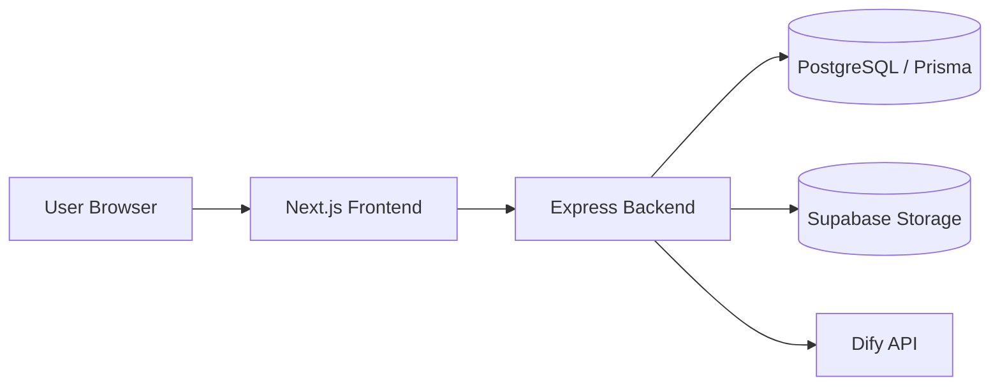
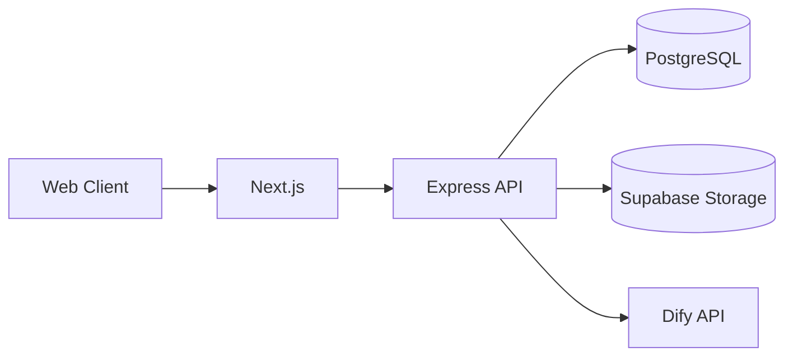

# LaneYa (เลนยา) — Monorepo

[English](#laneYa-english) · [ภาษาไทย](#laneYa-ภาษาไทย)

---

## LaneYa (ภาษาไทย)

### วิสัยทัศน์
**LaneYa** คือระบบผู้ช่วยคัดกรองอาการและสนับสนุนการจ่ายยาอย่างปลอดภัย โดยเชื่อมต่อ AI, โปรไฟล์สุขภาพผู้ใช้ และแดชบอร์ดผู้ดูแลในระบบเดียว

### เทคโนโลยีหลัก
| ชั้น | เทคโนโลยี |
|------|------------|
| Frontend | Next.js (App Router), React 19, next-intl, Tailwind CSS |
| Backend | Express + TypeScript |
| Database | PostgreSQL + Prisma |
| Storage | Supabase Storage |
| AI | Dify |

### โครงสร้าง Monorepo
```text
.
├── frontend/          # Next.js (UI + i18n + API client)
├── backend/           # Express + Prisma
├── docs/              # docs และ prompt
├── render.yaml        # ตัวอย่าง deploy backend
└── package.json       # npm workspaces (root)
```

### สถาปัตยกรรมระบบ


### Prisma Medical Fields
- `User.avatarUrl` รูปโปรไฟล์
- `User.age`, `User.weight` บริบทสุขภาพ
- `User.allergiesText` ประวัติแพ้ยาแบบข้อความ
- `User.allergyKeywords` คำสำคัญแพ้ยาแบบ normalize เพื่อใช้ Safety Check
- `Drug.imageUrl` รูปยา
- `Drug.ingredientsText` ส่วนประกอบยาแบบ comma-separated เช่น `paracetamol,caffeine`

### Safety Check (Backend)
- Utility: `backend/src/lib/safetyCheck.ts`
- ตรวจจับคำแพ้ยาของผู้ใช้ (`allergyKeywords` หรือ fallback จาก `allergiesText`)
- เทียบกับ `Drug.ingredientsText`
- คืนผล `isSafe`, `matchedAllergies`, และรายการที่ใช้ตรวจ
- Endpoint ใหม่: `GET /api/drugs/:id/safety-check` (ต้อง login)

### API หลัก
| Method | Path | คำอธิบาย |
|--------|------|----------|
| GET | `/health` | health check |
| POST | `/api/auth/register` | สมัครสมาชิก |
| POST | `/api/auth/login` | เข้าสู่ระบบ |
| GET/PATCH | `/api/users/me` | โปรไฟล์ผู้ใช้ |
| GET | `/api/drugs` | รายการยา |
| GET | `/api/drugs/:id/safety-check` | ตรวจแพ้ยารายตัว |
| POST | `/api/chat` | แชทกับ AI |
| GET | `/api/admin/stats` | สถิติผู้ดูแล |

### Screenshot Placeholders
- `docs/screenshots/ai-chat.png`
- `docs/screenshots/admin-dashboard.png`

```markdown


```

### การเริ่มต้นใช้งาน
```bash
npm install
npm run dev:backend
npm run dev:frontend
```

---

## LaneYa (English)

### Vision
**LaneYa** is a safety-first symptom guidance and medication support platform connecting AI triage, patient health context, and admin operations in one workflow.

### Tech Stack
| Layer | Technology |
|-------|------------|
| Frontend | Next.js (App Router), React 19, next-intl, Tailwind CSS |
| Backend | Express + TypeScript |
| Database | PostgreSQL + Prisma |
| Storage | Supabase Storage |
| AI | Dify |

### Monorepo Layout
```text
.
├── frontend/          # Next.js app
├── backend/           # Express API + Prisma
├── docs/              # docs and prompts
└── package.json       # npm workspaces
```

### Architecture


### Prisma Medical Fields
- `User.age`, `User.weight` for medical context
- `User.allergiesText` free-text allergy history
- `User.allergyKeywords` normalized allergy keywords for strict matching
- `Drug.ingredientsText` active ingredients used by Safety Check
- `Drug.imageUrl`, `User.avatarUrl` for UI

### Backend SafetyCheck Utility
- File: `backend/src/lib/safetyCheck.ts`
- Matches user allergy keywords against drug ingredients
- Supports strict keyword list and free-text fallback
- Returns deterministic safety result:
  - `isSafe`
  - `matchedAllergies`
  - `checkedAllergies`
  - `checkedIngredients`
- Route: `GET /api/drugs/:id/safety-check` (authenticated user)

### Screenshot Placeholders
- `docs/screenshots/ai-chat.png`
- `docs/screenshots/admin-dashboard.png`

```markdown


```

### Quick Start
```bash
npm install
npm run dev:backend
npm run dev:frontend
```

---

## License
Private/internal project.
